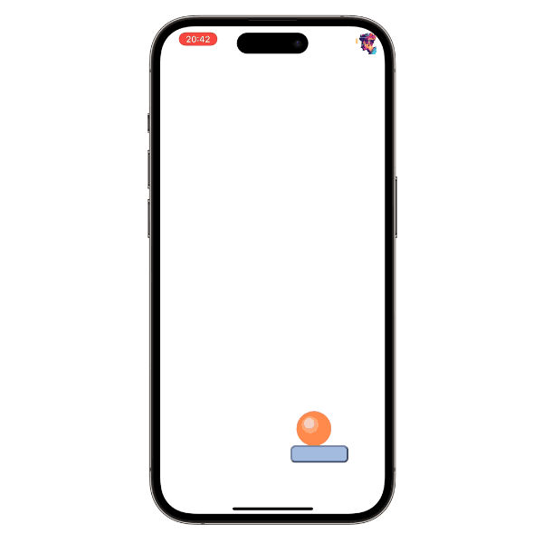

# expo-2d-game-engine

React Native 2D game engine built on Expo and [Skia](https://shopify.github.io/react-native-skia/)*:

- react-native
- expo
- react-native-skia: for graphics
- react-native-reanimated: for animations
- react-native-gesture-handler: for gesture input
- expo-av: for sound

*There is an old branch `old-expo-2d-context` that uses expo-2d-context/expo-gl instead of Skia.

## How to use

Clone this repository:

    git clone https://github.com/tomsoderlund/expo-2d-game-engine.git [MY_APP]
    
    cd [MY_APP]

Remove the `.git` folder since you want to create a new repository

    rm -rf .git

Install dependencies (you can use `yarn` or `npm` too):

    bun install

Start Expo for native apps:

    bun run dev

## Create builds for TestFlight and App Store

(Replace `ios` with `android` for Google Play)

    bun build:ios  # create a build with EAS
    bun submit:ios  # send the build to Apple/Google

## Modifying the game

Portrait vs Landscape:

`app.json`:

    "orientation": "landscape"
